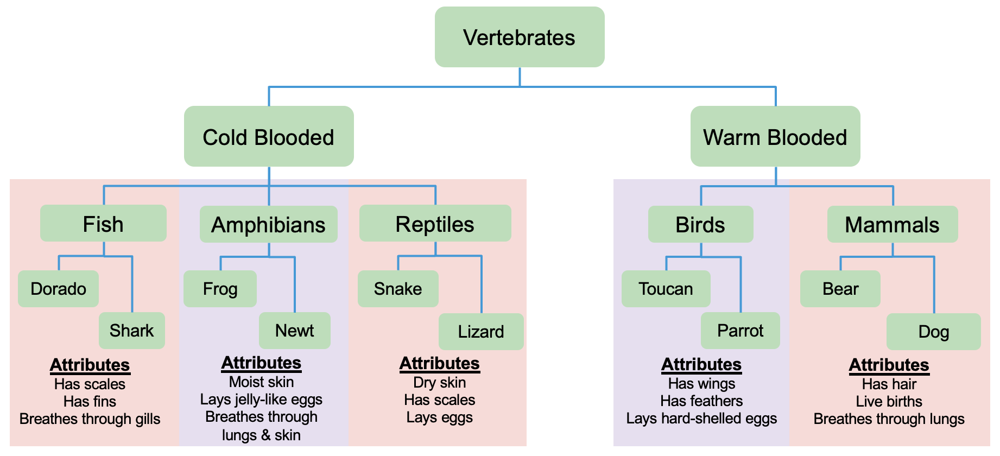

# Import is Important Tutorial
## Lab: Animal Classification System

## Part 2: Sharing Attributes Within a Package

Each classification level has attributes that apply to all animals in that category. For example, all fish share certain characteristics, while all mammals share different characteristics.

### Task 2.1: Create Shared Attributes
Use the classification diagram above to see some characteristics that all fish share. Create a way to store these shared attributes so that individual fish modules can access them without copying them to each fish module.

**Challenge:** Where should you put these shared attributes? How should you name the file or module?

### Task 2.2: Import Attributes into a Module
Now give your `shark` module the ability to access the shared fish attributes. Experiment with different import approaches:

**Approach 1:** Import the entire attributes module into the `shark` module
- Try importing the attributes as a module object in your `shark` module
- In `main.py`, import the `shark` module and update the `print` statements to print out the attributes
- Question: Can you access attributes directly on the shark, or do you need to go through the attributes module?

**Approach 2:** Import specific attributes into the `shark` module
- Import individual attributes from the shared module into the `shark` module
- In `main.py`, try accessing these attributes directly from the `shark` module first using an absolute import statement, then with a relative import statement.
- Question: What's the difference in how you access these attributes compared to Approach 1?

**Approach 3:** Import everything at once
- Import all attributes from the attributes module into the shark module without specifying them individually
- Question: What are the trade-offs of this approach?
- Question: Which of the three import approaches do you prefer? Why?

**Approach 4:** Use relative imports
- Import your attributes from their location without specifying the fully-qualified package structure
- Question: When using this approach, what happens if you try to run the `shark` module as a script (e.g., `python3.14 <pkg>/shark.py`)? Why does this happen, and how can you fix it?

##### Success
You'll know you succeeded when:
1. You've tried each of the four approaches listed above and understand the differences between each approach.
1. Each of the four approaches prints the fish attributes without errors.

##### Reflection
- What does the dot (`.`) mean in import statements?
- What's the difference between relative and absolute imports?
- Which approach makes the most sense for your use case and why?

---

Next Up: [Part 3: Package-Level Imports with `__init__.py`](03_part3.md)